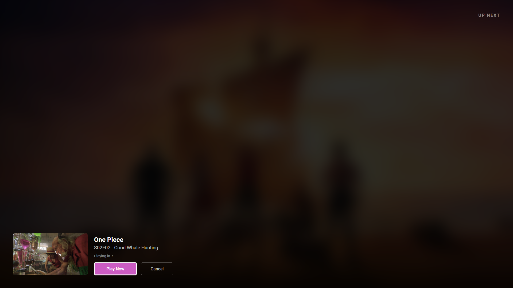
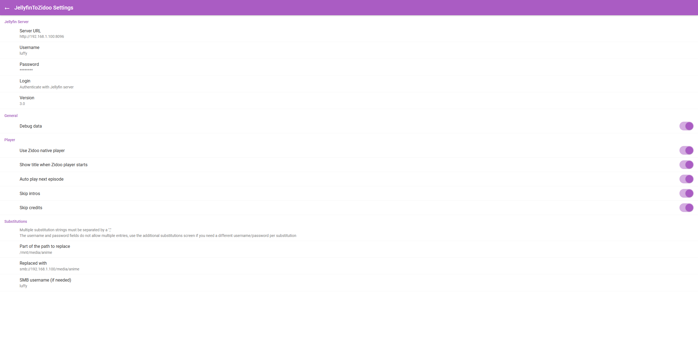

<p align="center">
  
</p>

<h1 align="center">JellyfinToZidoo</h1>

<p align="center">
  <strong>Bridge Jellyfin to native Zidoo playback with full hardware decoding and automatic watch state sync.</strong>
</p>

<p align="center">
  <a href="https://github.com/magnetgrouplabs/JellyfinToZidoo/releases/latest"></a>
  <a href="LICENSE"></a>
  <a href="https://github.com/magnetgrouplabs/JellyfinToZidoo/issues"></a>
  <a href="https://github.com/magnetgrouplabs/JellyfinToZidoo/stargazers"></a>
  <a href="https://github.com/magnetgrouplabs/JellyfinToZidoo/actions/workflows/build.yml"></a>
  
</p>

---

Play media from any Jellyfin client and the Zidoo handles playback with full hardware decoding (Dolby Vision, DTS, TrueHD, and more). Watch state syncs seamlessly back to Jellyfin so your progress is always up to date.

<p align="center">
  
  <br/>
  <em>Up Next countdown between episodes</em>
</p>

<p align="center">
  
  <br/>
  <em>Settings with server, player, and path substitution configuration</em>
</p>

## Features

| Feature | Description |
|---------|-------------|
| **Native Zidoo playback** | Launches the Zidoo player via SMB for best-in-class hardware video processing |
| **Watch state sync** | Playback progress and watched status report back to Jellyfin automatically |
| **Resume position** | Pick up where you left off, synced between Jellyfin and Zidoo |
| **Up Next** | Countdown screen between episodes with Play Now / Cancel, just like streaming apps |
| **Binge watching** | When Zidoo auto-advances to the next file, each episode is tracked individually in Jellyfin |
| **Intro skip** | Automatically skips intros using data from Jellyfin's [Intro Skipper](https://github.com/intro-skipper/intro-skipper) plugin |
| **Credit skip** | Stops playback at credits and triggers Up Next early |
| **Audio/subtitle passthrough** | Track selections from the Jellyfin client carry through to the Zidoo player |
| **Disarm-on-seek** | Manual seeking disables auto-skip so your intent is respected |
| **Path substitution** | Up to 10 configurable rules to map Jellyfin server paths to SMB URIs |
| **Settings import/export** | Back up and restore configuration (tokens excluded for security) |

## Requirements

- Zidoo needs direct access to your Jellyfin media through SMB
- Zidoo needs to have firmware version 6.4.42+ installed
  - Releases can be found here: https://www.zidoo.tv/Support/downloads.html
- Zidoo must have the Play mode set to "Single file" or watched status and resume points may not update properly
  - Quick Settings > Playback > Play mode, then select "Single file"
- A Jellyfin server with username/password authentication enabled
- Optional: [Intro Skipper](https://github.com/intro-skipper/intro-skipper) plugin on the Jellyfin server for intro/credit skip

## Installation

Install this app from the release page. Releases can be found here: https://github.com/magnetgrouplabs/JellyfinToZidoo/releases

**Option A: Downloader app (easiest)**
1. Open the [Downloader](https://www.aftvnews.com/downloader/) app on your Zidoo
2. Enter code **3064877**
3. The APK will download and prompt you to install

**Option B: Manual install**
1. Download the latest APK from the [Releases](https://github.com/magnetgrouplabs/JellyfinToZidoo/releases/latest) page
2. Transfer the APK to your Zidoo (USB or network share) and open it to install

## Setup

### 1. Configure JellyfinToZidoo

Open JellyfinToZidoo on your Zidoo. You will see the settings screen. Enter the following:

- **Server URL** - Your Jellyfin server address (e.g. `http://192.168.1.100:8096`)
- **Username** and **Password** - Your Jellyfin login credentials
- Tap **Login** to authenticate

### 2. Set up path substitution (SMB)

JellyfinToZidoo plays media through the Zidoo's native player via SMB. This means your Zidoo needs direct network access to the same files that Jellyfin manages. Path substitution tells JellyfinToZidoo how to translate a Jellyfin server path into an SMB path that the Zidoo can reach.

In the **Substitutions** section of settings:

| Field | Example |
|-------|---------|
| **Part of the path to replace** | `/mnt/media/tv` |
| **Replaced with** | `smb://192.168.1.100/media/tv` |
| **SMB username** | *(your NAS/share username, if required)* |
| **SMB password** | *(your NAS/share password, if required)* |

**How it works:** When Jellyfin reports a file at `/mnt/media/tv/Breaking Bad/S01E01.mkv`, JellyfinToZidoo replaces the matching path segment to produce `smb://192.168.1.100/media/tv/Breaking Bad/S01E01.mkv`, which the Zidoo player opens natively.

You can configure up to **10 substitution rules** if your media spans multiple shares or mount points. Use the **More Substitution Rules** link in settings to add rules 3 through 10.

> **Tip:** Enable **Debug data** in settings when first configuring path substitution. The debug overlay will show you the resolved SMB path so you can verify it is correct before disabling debug mode.

### 3. Set JellyfinToZidoo as your external player

In your Jellyfin client app, configure it to use JellyfinToZidoo as an external video player. The exact steps depend on which client you use:

- **Jellyfin for Android TV** - Go to Settings > Client Settings > Video Player Type and select "External Player", then choose JellyfinToZidoo when prompted
- **Moonfin** - Go to Settings > Player and configure the external player option

### 4. Play something

Browse your library in your Jellyfin client and play any video. The Jellyfin client will hand off playback to JellyfinToZidoo, which launches the native Zidoo player via SMB. Playback progress, watched status, and resume position all sync back to Jellyfin automatically.

## Tested Clients

JellyfinToZidoo has been tested and verified with the following Jellyfin clients:

- [**Jellyfin for Android TV**](https://github.com/jellyfin/jellyfin-androidtv) - The official Jellyfin client for Android TV devices
- [**Moonfin**](https://github.com/Moonfin-Client/AndroidTV-FireTV) - A third-party Jellyfin client for Android TV and Fire TV

JellyfinToZidoo should work with **any Jellyfin client** that supports sending external player intents, including [Findroid](https://github.com/jarnedemeulemeester/findroid) and others. If you have tested it with a client not listed here, feel free to open an issue and let us know.

## How It Works

1. Your Jellyfin client sends a play intent containing the streaming URL and item ID
2. JellyfinToZidoo resolves the server-side file path via the Jellyfin API
3. Path substitution converts the server path to an SMB URI
4. The native Zidoo player launches with the SMB path, resume position, and audio/subtitle track selections
5. A background poller monitors playback and reports progress back to Jellyfin
6. When an episode ends, the **Up Next** screen appears with a countdown to the next episode

## Building from Source

If you prefer to build the APK yourself:

```bash
git clone https://github.com/magnetgrouplabs/JellyfinToZidoo.git
cd JellyfinToZidoo
./gradlew assembleDebug
```

The APK will be at `app/build/outputs/apk/debug/app-debug.apk`.

## Attribution

Forked from [PlexToZidoo](https://github.com/bowlingbeeg/PlexToZidoo) by **bowlingbeeg**.

PlexToZidoo provided the foundational Zidoo player integration, path substitution logic, and SMB playback pipeline that this project builds upon. The original Plex API code is preserved in the source as commented blocks marked with `PLEX_REMOVED` for reference.

Thank you to bowlingbeeg and all PlexToZidoo contributors for their work on Zidoo external player support.

## License

MIT. See [LICENSE](LICENSE) for details.

---

<h2 align="center">Support the Project</h2>

<p align="center">
  JellyfinToZidoo is free, open-source software maintained in spare time.<br/>
  If it has saved you from manually marking episodes as watched (we have all been there),<br/>
  consider buying me a coffee to support continued development.
</p>

<p align="center">
  <a href="https://buymeacoffee.com/anthonymkz">
    
  </a>
</p>
